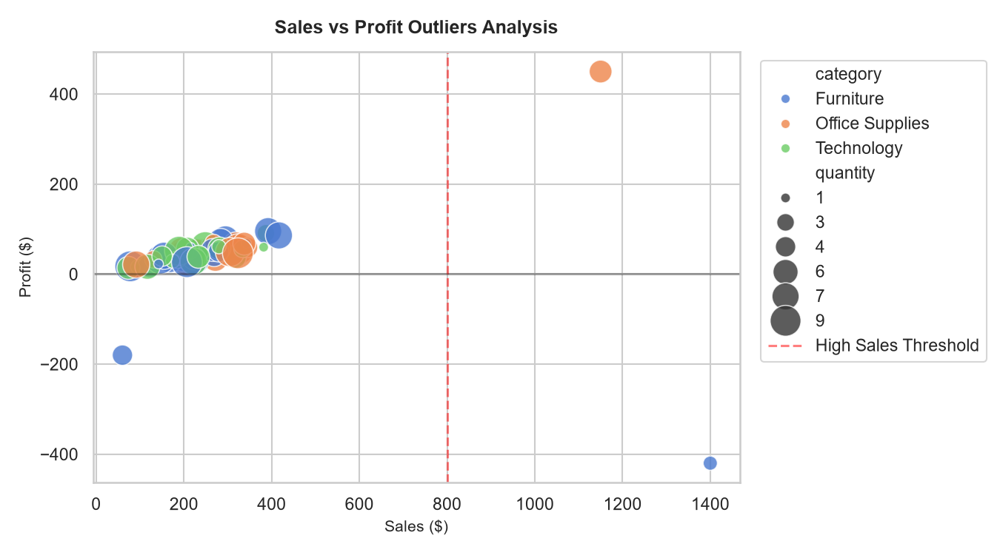
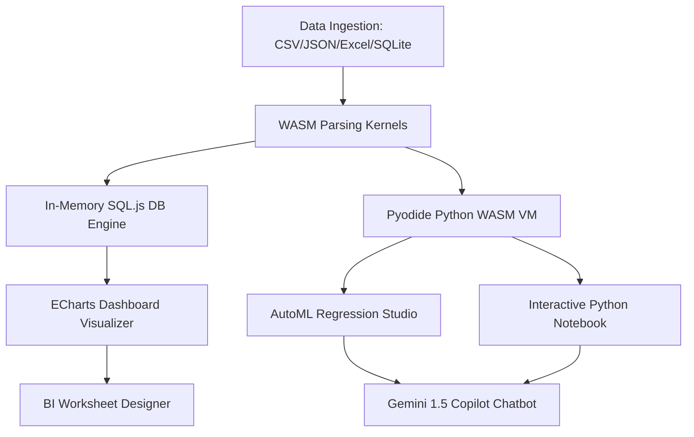

# 🌌 EAOS: Enterprise Analytics Operating System
> **3D Cinematic Data Engine & In-Browser Python-WASM Sandbox**

<div align="center">
  
</div>

---

## ⚡ System Highlights
- **🚀 WebAssembly SQLite Kernel**: Zero-latency relational queries executed directly in the browser's sandbox.
- **🐍 Pyodide Python Console**: Run full Pandas & NumPy computations client-side (no backend required!).
- **🤖 AutoML Regression Engine**: Train linear and Ridge estimators inside the WASM workspace.
- **✨ Glassmorphic UI/UX**: Ultra-responsive layout engineered with custom CSS Grid matrices.
- **🛡️ Google Gemini Copilot**: AI-driven transaction analysis and financial anomalies detection.

---

## 🏗️ Architectural Topology



---

## 💻 Console Launch sequence

```bash
# 1. Initialize local server environment
python -m http.server 8000

# 2. Compile database pipeline & queries
python sales_agent_pipeline.py

# 3. Access the holographic matrix
# Open browser at: http://localhost:8000
```

---

## 📁 Holographic Blueprint Map

- 🖥️ [public/index.html](file:///c:/Users/amank/OneDrive/Desktop/Agentic%20Data%20Analytics%20Pipeline/public/index.html) — Layout structure, CDNs, and UI grid modules.
- 🎨 [public/style.css](file:///c:/Users/amank/OneDrive/Desktop/Agentic%20Data%20Analytics%20Pipeline/public/style.css) — Mobile-first glassmorphism styling, glowing radial meshes.
- ⚙️ [public/app.js](file:///c:/Users/amank/OneDrive/Desktop/Agentic%20Data%20Analytics%20Pipeline/public/app.js) — Pyodide, SQL.js, AutoML, ECharts, and Gemini API bindings.
- 🐍 [sales_agent_pipeline.py](file:///c:/Users/amank/OneDrive/Desktop/Agentic%20Data%20Analytics%20Pipeline/sales_agent_pipeline.py) — Synthetic data cleaning, normalization, and database compilation.

---

## 🚀 Live Matrix Deployed
The application is fully hosted on Firebase:
👉 **[agentic-data-analyticspipeline.web.app](https://agentic-data-analyticspipeline.web.app)**
