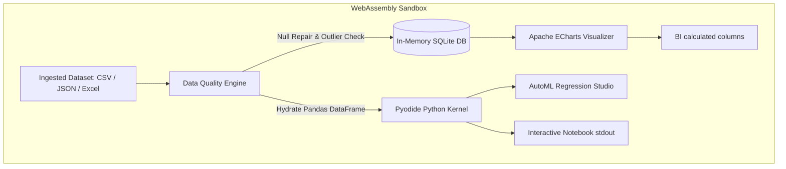

# 🌌 EAOS: Enterprise Analytics Operating System
> **3D Cinematic Data Engine & In-Browser Python-WASM Sandbox**

<div align="center">
  <!-- Interactive 3D Spinning Tech Wheel SVG -->
  <svg viewBox="0 0 200 200" width="180" height="180" xmlns="http://www.w3.org/2000/svg" style="filter: drop-shadow(0 0 15px rgba(99, 102, 241, 0.4));">
    <style>
      .spin-forward {
        transform-origin: 100px 100px;
        animation: spinFwd 15s linear infinite;
      }
      .spin-backward {
        transform-origin: 100px 100px;
        animation: spinBwd 10s linear infinite;
      }
      .pulse-glow {
        animation: pulseGlow 4s ease-in-out infinite;
      }
      @keyframes spinFwd {
        0% { transform: rotate(0deg); }
        100% { transform: rotate(360deg); }
      }
      @keyframes spinBwd {
        0% { transform: rotate(360deg); }
        100% { transform: rotate(0deg); }
      }
      @keyframes pulseGlow {
        0%, 100% { opacity: 0.15; transform: scale(0.95); }
        50% { opacity: 0.6; transform: scale(1.05); }
      }
    </style>
    <!-- Pulsing Radial Glow -->
    <circle cx="100" cy="100" r="75" fill="url(#glowGrad)" class="pulse-glow" style="transform-origin: 100px 100px;"/>
    
    <!-- Outer Tech Ring -->
    <circle cx="100" cy="100" r="85" stroke="#6366f1" stroke-width="1.5" stroke-dasharray="12 6 3 6" fill="none" class="spin-forward"/>
    
    <!-- Inner Segmented Ring -->
    <circle cx="100" cy="100" r="65" stroke="#06b6d4" stroke-width="2" stroke-dasharray="40 15" fill="none" class="spin-backward"/>
    
    <!-- Crosshairs & Grid Lines -->
    <g stroke="rgba(99, 102, 241, 0.25)" stroke-width="1">
      <line x1="100" y1="10" x2="100" y2="190"/>
      <line x1="10" y1="100" x2="190" y2="100"/>
      <line x1="36.4" y1="36.4" x2="163.6" y2="163.6"/>
      <line x1="36.4" y1="163.6" x2="163.6" y2="36.4"/>
    </g>
    
    <!-- Center Core -->
    <circle cx="100" cy="100" r="15" fill="#0b0f1d" stroke="#6366f1" stroke-width="2"/>
    <circle cx="100" cy="100" r="6" fill="#06b6d4"/>
    
    <defs>
      <radialGradient id="glowGrad" cx="50%" cy="50%" r="50%">
        <stop offset="0%" stop-color="#6366f1" stop-opacity="1"/>
        <stop offset="100%" stop-color="#03050a" stop-opacity="0"/>
      </radialGradient>
    </defs>
  </svg>

  <h3>📊 3D DIGITAL DATA MATRIX OPERATING SYSTEM</h3>
  
  <p>
    <a href="https://agentic-data-analyticspipeline.web.app"></a>
    <a href="https://github.com/Amank326/Agentic-Analytics-Pipeline"></a>
  </p>
</div>

---

## 🚀 Interactive Sandbox Overview

The **Enterprise Analytics Operating System (EAOS)** is an end-to-end client-side ecosystem built entirely in WebAssembly and vanilla HTML5/CSS3. It eliminates the need for remote database backends and notebook runtimes by compiling both SQLite and Python interpreters inside the local browser viewport.

<div align="center">
  
</div>

---

## 🌌 High-Performance Core Modules

### 1. 🐍 Pyodide Python Notebook
- **Local Compiler**: Runs standard scientific Python libraries (Pandas, NumPy, Scikit-Learn) inside a secure WASM browser container.
- **Auto-Hydrated**: Automatically parses the active data array into a Pandas DataFrame (`df`) on document load.
- **StdOut Capturer**: Renders custom Python outputs into a simulated monospaced dark terminal display.

### 2. 🗄️ SQLite WASM Kernel
- **SQL.js Runtime**: Pre-compiles synthetic dataset inputs into a local SQL DB structure.
- **Sandbox Play**: Supports real-time execution of complex SELECT queries, JOIN tables, and GROUP BY records.

### 3. 🤖 AutoML Predictor Studio
- **OLS / Ridge Estimators**: Train multivariate regression algorithms inside WebAssembly.
- **Metrics Evaluator**: Displays live performance statistics including Mean Absolute Error (MAE), Root Mean Squared Error (RMSE), and R² margins.

### 4. 🎛️ No-Code ETL Workspace
- **Drag-and-Drop Nodes**: Link data Source, Filter, Aggregation, and Export operators.
- **Flow Control**: Verify ingestion logic before loading records into the relational database.

---

## 🛠️ Interactive Pipeline Topology



---

## ⚙️ Compilation & Local Boot

```bash
# Clone the matrix repo
git clone https://github.com/Amank326/Agentic-Analytics-Pipeline.git
cd Agentic-Analytics-Pipeline

# Generate synthetic cleaned dataset
python sales_agent_pipeline.py

# Launch local server
python -m http.server 8000
# Holographic interface active at: http://localhost:8000
```

---

## 🏢 Technical Architecture Specifications

| Subsystem | Underlying Technology | Operational State | Execution Scope |
| :--- | :--- | :--- | :--- |
| **SQL Engine** | SQL.js (SQLite compiled to WASM) | `ONLINE` | Local in-memory sandbox |
| **Python Sandbox** | Pyodide (CPython 3.11 WASM compilation) | `READY` | Pandas, NumPy, Scikit-Learn |
| **AI Copilot** | Google Gemini (v1beta API stream) | `CONNECTED` | Natural language transactions query |
| **Data Viz** | Apache ECharts 5.5.0 | `INITIALIZED` | Interactive financial graphics |
| **Layout Matrix** | HTML5 / Mobile-First CSS Flexbox | `OPTIMIZED` | Portrait & landscape auto-wrap |

---

## 📁 Holographic Blueprint Map

- 🖥️ [public/index.html](file:///c:/Users/amank/OneDrive/Desktop/Agentic%20Data%20Analytics%20Pipeline/public/index.html) — Layout structure, CDNs, and UI grid modules.
- 🎨 [public/style.css](file:///c:/Users/amank/OneDrive/Desktop/Agentic%20Data%20Analytics%20Pipeline/public/style.css) — Mobile-first glassmorphism styling, glowing radial meshes.
- ⚙️ [public/app.js](file:///c:/Users/amank/OneDrive/Desktop/Agentic%20Data%20Analytics%20Pipeline/public/app.js) — Pyodide, SQL.js, AutoML, ECharts, and Gemini API bindings.
- 🐍 [sales_agent_pipeline.py](file:///c:/Users/amank/OneDrive/Desktop/Agentic%20Data%20Analytics%20Pipeline/sales_agent_pipeline.py) — Synthetic data cleaning, normalization, and database compilation.
